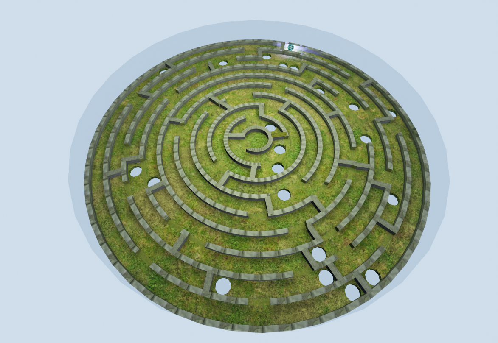
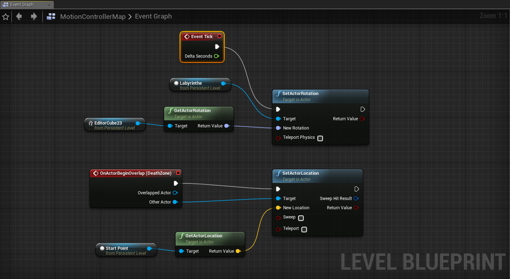

# Okey Projet Labyrinthe VR

Projet VR sous Unreal Engine dans le cadre de notre cours VR.

# But du jeu

Pour finir le jeu, le joueur doit ammener la sphere au centre du labyrinthe. Des trous empêcheront le joueur de remporter la victoire trop facilement. Si la sphère tombe dans l'un de ces trous, elle est téléportée au début du labyrinthe et le joueur doit alors recommencer depuis le début.

# Gameplay

Le joueur se retrouve sur un plaque en verre situé au dessus du labyrinthe et peut attraper et controller un petit cube à l'aide d'un des deux contrôleurs. Toute rotation sur ce cube se répercute sur le labyrinthe. C'est ainsi que la sphère pourra être déplacée dans le niveau. La difficulté n'est pas de trouver le bon chemin jusqu'au centre du labyrinthe mais de manipuler le cube controlleur dans l'espace. 

# Réalisation

Le labyrinthe a été créé sous Unreal et exporté en un seul mesh. Les matériaux utilisés sont ceux proposés par le starter content d'Unreal Engine et l'intégration du gameplay s'est fait à l'aide des objets avec lesquels on peut interagir deja présent dans la scène lors de la création d'un projet VR. En l'occurence, il s'agit du cube controlleur qui avait deja le Blueprint permettant de l'attraper avec les controlleurs. Nous avons lié ce cube au modèle 3D du labyrinthe pour pouvoir le manipuler en répercutant les rotations du cube sur le labyrinthe. Le joueur n'a aucune emprise sur la sphère. Seule la gravité la fait bouger grâce à l'inclinaison du labyrinthe.

## Team

**Nathan Desages**  
**Valentin Moulard**  
